# 📡 3GPP Event-Driven Data Synchronization & Multi-Agent RAG Architecture on AWS

A production-grade, serverless, event-driven pipeline that automates 3GPP technical standards ingestion, preprocessing, vectorization, and powers a LangGraph multi-agent reasoning system.

---

## Architecture Diagram

```mermaid
flowchart LR
    subgraph SOURCE["1. INGESTION"]
        FTP["🌐 3GPP FTP Servers"]
        EB["⏰ EventBridge<br/>(every 1 hour)"]
        L1["⚡ Lambda<br/>Change Detector"]
        S3R["🪣 S3 Raw Bucket<br/>(by Release)"]
        EB --> L1 --> FTP
        L1 --> S3R
    end

    subgraph PREPROCESS["2. PREPROCESSING"]
        L2["⚡ Lambda<br/>Preprocessor"]
        TX["📄 Textract<br/>Table + Layout"]
        GL["🔧 Glue<br/>Parser/Chunker"]
        S3P["🪣 S3 Processed<br/>(Parquet)"]
        L2 --> TX --> GL --> S3P
    end

    subgraph VECTOR["3. VECTORIZATION"]
        L3["⚡ Lambda<br/>Vector Generator"]
        SM["🧠 SageMaker<br/>Embeddings"]
        AU["🗄️ Aurora pgvector<br/>UPSERT"]
        L3 --> SM --> AU
    end

    subgraph AGENTS["4. MULTI-AGENT (LangGraph)"]
        PL["🧭 Planner"]
        TS["📋 TS Analyzer"]
        PHY["📡 PHY/MAC Expert"]
        REL["🔄 Release Comparator"]
        GK["🚦 Gatekeeper"]
        AD["✅ Auditor"]
        PL --> TS & PHY & REL
        TS & PHY & REL --> GK --> AD
    end

    subgraph OUTPUT["5. OUTPUT"]
        USR["👷 Engineers"]
    end

    S3R -->|"s3:ObjectCreated"| L2
    S3P -->|"s3:ObjectCreated"| L3
    AU -->|"synchronized"| PL
    AD --> USR

    style SOURCE fill:#1a237e,color:#fff
    style PREPROCESS fill:#004d40,color:#fff
    style VECTOR fill:#b71c1c,color:#fff
    style AGENTS fill:#4a148c,color:#fff
    style OUTPUT fill:#e65100,color:#fff
```



---

## Key Features

- **Zero Manual Intervention** — Fully automated from FTP detection to knowledge base sync
- **Event-Driven** — S3 events trigger immediate processing (no polling delays)
- **Release-Aware** — All data partitioned by 3GPP Release (Rel-15/17/18+)
- **Structure Preservation** — Textract + hierarchical parsing maintains table integrity
- **Multi-Agent Validation** — Gatekeeper + Auditor ensure technical accuracy
- **Observable** — LangSmith provides cost/latency/quality visibility

---

## Quick Start (POC)

```bash
cd poc

# 1. Start PostgreSQL with pgvector
docker run -d --name pgvector \
  -e POSTGRES_PASSWORD=postgres \
  -e POSTGRES_DB=knowledge_base_3gpp \
  -p 5432:5432 \
  pgvector/pgvector:pg16

# 2. Setup database
pip install -r requirements.txt
python setup_db.py

# 3. Ingest a 3GPP PDF
python ingest.py --file your_spec.pdf --release rel-17

# 4. Run the chatbot
streamlit run app.py
```

---

## Project Structure

```
3gpp-rag-architecture/
├── README.md                    # This file
├── architecture.html            # Interactive visual diagram
├── infra/
│   └── stack.py                 # AWS CDK infrastructure
├── poc/
│   ├── app.py                   # Streamlit UI
│   ├── setup_db.py              # Database initialization
│   ├── ingest.py                # PDF ingestion pipeline
│   ├── requirements.txt         # POC dependencies
│   ├── .env.example             # Config template
│   ├── agents/
│   │   ├── graph.py             # LangGraph orchestration
│   │   ├── planner.py           # Planner + retrieval agent
│   │   ├── ts_analyzer.py       # TS Analyzer agent
│   │   └── validator.py         # Gatekeeper + Auditor
│   └── lambda_functions/
│       ├── change_detector.py   # FTP polling simulation
│       └── preprocessor.py      # Text extraction + chunking
└── .env.example                 # Root config template
```

---

## Tech Stack

| Layer | Service |
|-------|---------|
| Scheduling | Amazon EventBridge |
| Compute | AWS Lambda |
| Storage | Amazon S3 |
| Extraction | Amazon Textract |
| ETL | AWS Glue (Serverless) |
| Embeddings | Amazon SageMaker |
| Vector DB | Aurora Serverless (pgvector) |
| Orchestration | LangGraph |
| Monitoring | LangSmith |
| UI | Streamlit |

---

## License

MIT
